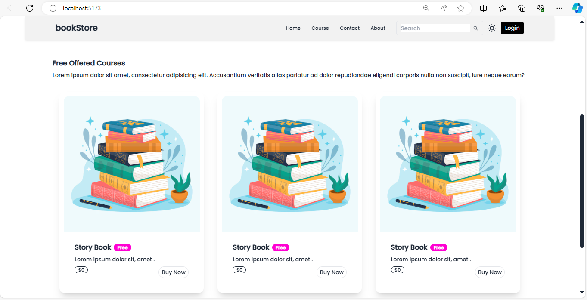
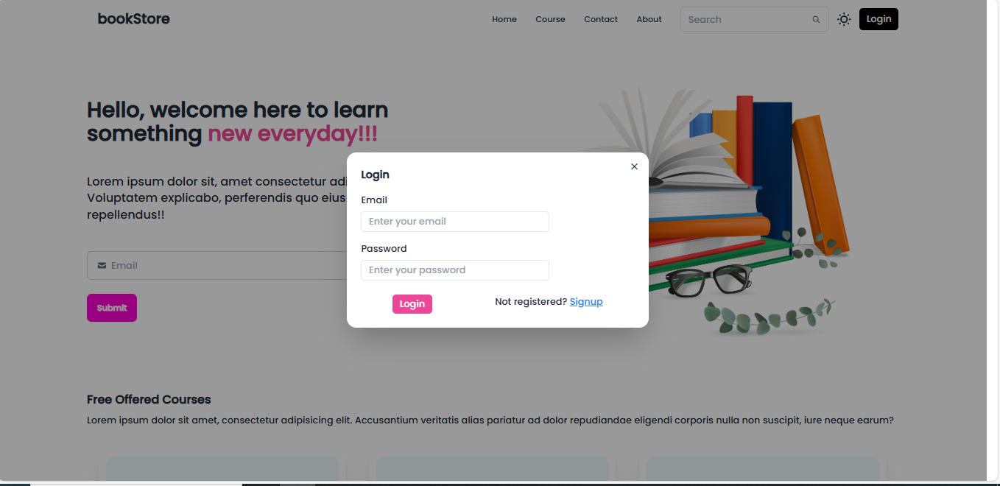
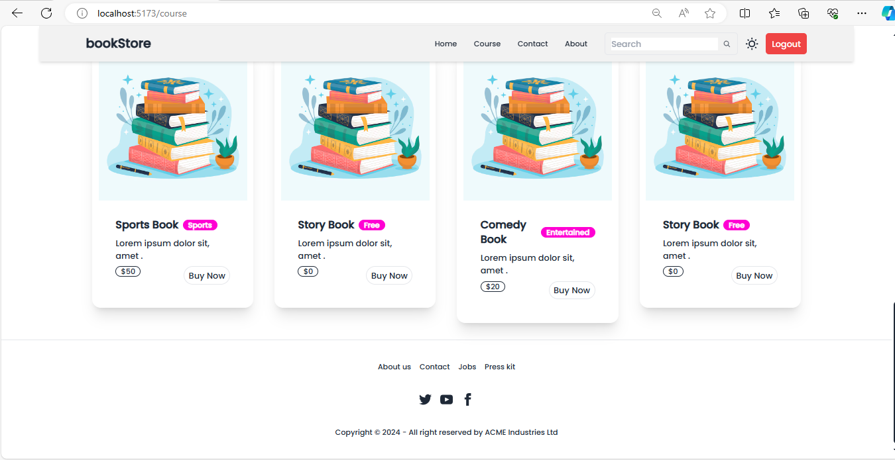

# Bookstore-mern

Mern Stack Application

In the project directory, you can run:

### `npm install`

For Frontend

### `npm run dev`

For Backend

### `npm start`

Home page

SignIn page

Login page

Course page

